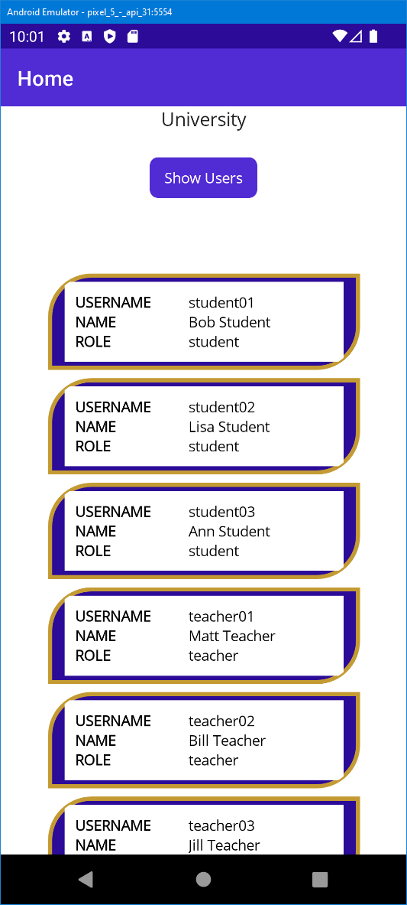

# .NET MAUI Example

You can find the instructions for making this kind of application from
https://dotnet.microsoft.com/en-us/learn/maui/first-app-tutorial/intro

## Android

In Android emulator the application looks like this 

